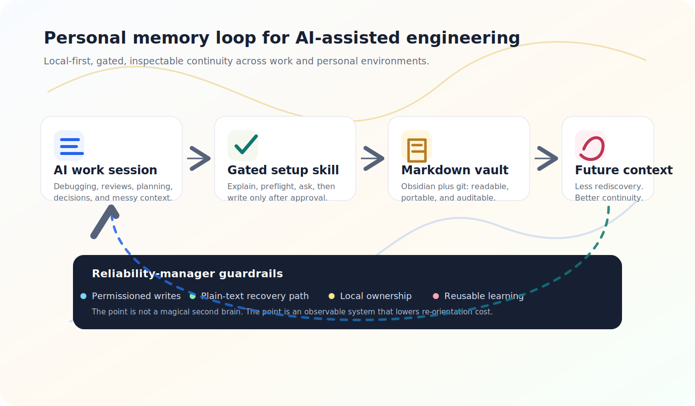

# claude-plugins

[](https://github.com/adzuci/claude-plugins/actions/workflows/ci.yml)
[](https://adzuci.github.io/claude-plugins/)

Public Claude Code and Codex plugins for local-first AI workflows.

The first plugin in this repo is **`memory`**: a setup skill for creating a local, git-backed Obsidian vault that captures durable notes from AI working sessions.

**Read the companion post:** [Memory as reliability practice](https://adzuci.github.io/claude-plugins/)



## Why This Exists

AI sessions can be useful in the moment and still disappear as soon as the thread ends. The assistant helped debug a strange failure, compare trade-offs, draft a review, or clarify a decision, but the useful context stayed trapped in a transcript.

`memory` is a small attempt to make that context durable without making it mysterious:

- Obsidian for plain Markdown that stays inspectable
- git for auditable history
- explicit setup gates before anything writes to dotfiles
- Claude Code session capture as the first-class path
- compatibility notes for Codex and Antigravity so the memory belongs to the person, not one assistant

The goal is not a grand second-brain system. The goal is lower re-orientation cost: fewer repeated explanations, fewer lost decisions, and a clearer trail from “we figured this out” to “we can reuse this later.”

## What the `memory` Plugin Does

| Skill | Purpose |
| --- | --- |
| `/memory:memory-setup` | Set up an Obsidian-backed memory vault with Claude Code session capture and optional Codex/Antigravity importers. |

The default Claude Code path sets up:

- a local Obsidian vault under a user-selected parent directory
- `claudian` and `obsidian-git` as Obsidian community plugins
- a `SessionEnd` hook in `~/.claude/settings.json`
- a managed memory block in `~/.claude/CLAUDE.md`

Current support note: the setup flow has been tested on macOS. Linux and Windows compatibility reports and PRs are very welcome.

## Install

Claude Code marketplace metadata lives in `.claude-plugin/marketplace.json`.

Codex marketplace metadata lives in `.agents/plugins/marketplace.json`.

For Codex:

```bash
codex plugin marketplace add adzuci/claude-plugins
codex plugin add memory@adzuci-plugins
```

For Claude Code:

```bash
claude plugin marketplace add adzuci/claude-plugins
claude plugin install memory@adzuci-plugins
```

Then invoke the setup skill:

```text
/memory:memory-setup
```

## Safety Model

This skill is intentionally cautious because it touches personal knowledge and local configuration.

- It explains the trade-offs before setup.
- It runs read-only preflight checks first.
- It asks before installing Obsidian.
- It backs up settings before editing.
- It keeps generated memory in plain Markdown.
- It is designed to be rerunnable and idempotent where possible.

The repo includes CI for the bundled Python scripts and plugin metadata:

- compile all memory setup scripts and tests
- run the pytest suite on Python 3.9 and 3.12
- validate marketplace and plugin JSON
- verify the static site references existing assets

## Repository Structure

```text
.claude-plugin/
  marketplace.json
.agents/
  plugins/
    marketplace.json
.github/
  workflows/
    ci.yml
docs/
  index.html
  assets/
plugins/
  memory/
    .claude-plugin/plugin.json
    .codex-plugin/plugin.json
    README.md
    skills/memory-setup/
      SKILL.md
      scripts/
      templates/
      references/
      tests/
```

## Development

This repo is intentionally small, but the bar for changes is still: can someone else install it, understand what it writes, and recover cleanly if something goes wrong?

Run the memory skill tests:

```bash
python3 -m pytest plugins/memory/skills/memory-setup/tests -q
```

Validate the plugin metadata with the CLI available in your environment:

```bash
claude plugin validate .
```

## Contributing

If this workflow is useful, please open an issue or PR. The most valuable feedback is concrete:

- setup failures on a real machine
- Linux or Windows compatibility fixes
- missing preflight checks
- unclear install instructions
- unsafe or surprising writes
- compatibility fixes for Claude Code, Codex, Antigravity, Obsidian, or git

Small, focused PRs are welcome. Please include the command you ran, the environment you tested on, and whether `python3 -m pytest plugins/memory/skills/memory-setup/tests -q` passed.

## License

MIT
